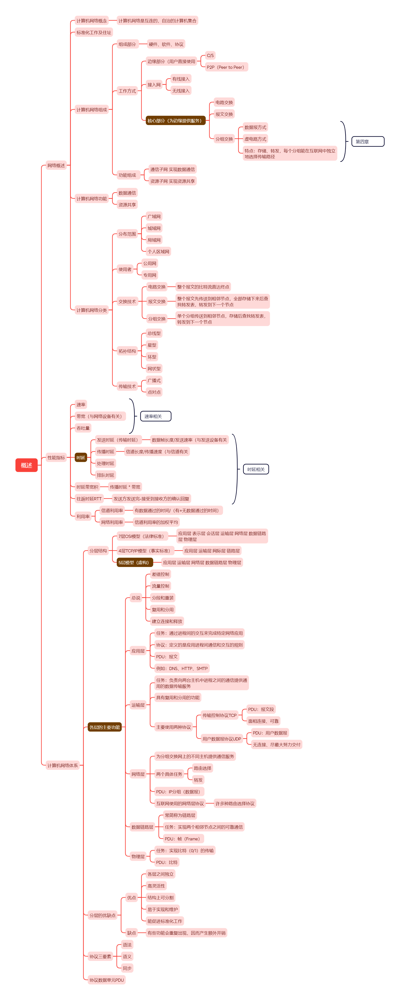

# 概述

## 网络概述

### 计算机网络概念

- 计算机网络是互连的，自治的计算机集合

### 标准化工作及住址

### 计算机网络组成

- 组成部分 

	- 硬件、软件、协议

- 工作方式

	- 边缘部分（用户直接使用

		- C/S

		- P2P（Peer to Peer）

	- 接入网

		- 有线接入

		- 无线接入

	- 核心部分（为边缘提供服务）

		- 电路交换

		- 报文交换

		- 分组交换

			- 数据报方式

			- 虚电路方式

			- 特点：每个分组能在互联网中独立地选择传输路径

- 功能组成

	- 通信子网 实现数据通信

	- 资源子网 实现资源共享

### 计算机网络功能

- 数据通信

- 资源共享

### 计算机网络分类

- 分布范围

	- 广域网

	- 城域网

	- 局域网

	- 个人区域网

- 使用者

	- 公用网

	- 专用网

- 交换技术

	- 电路交换

		- 整个报文的比特流直达终点

	- 报文交换

		- 整个报文先传送到相邻节点，全部存储下来后查找转发表，转发到下一个节点

	- 分组交换

		- 单个分组传送到相邻节点，存储后查找转发表，转发到下一个节点

- 拓补结构

	- 总线型

	- 星型

	- 环型

	- 网状型

- 传输技术

	- 广播式

	- 点对点

## 性能指标

### 速率

### 带宽（与网络设备有关）

### 吞吐量

### 时延

- 发送时延（传输时延）

	- 数据帧长度/发送速率（与发送设备有关

- 传播时延

	- 信道长度/传播速度（与信道有关

- 处理时延

- 排队时延

### 时延带宽积

- 传播时延＊带宽

### 往返时延RTT

- 发送方发送完-接受到接收方的确认回复

### 利用率

- 信道利用率

	- 有数据通过的时间/（有+无数据通过的时间）

- 网络利用率

	- 信道利用率的加权平均

## 计算机网络体系

### 分层结构

- 7层OSI模型（法律标准）

	- 应用层 表示层 会话层 运输层 网络层 数据链路层 物理层

- 4层TCP/IP模型（事实标准）

	- 应用层 运输层 网际层 链路层

- 5层模型（虚构）

	- 应用层 运输层 网络层 数据链路层 物理层

### 各层的主要功能

- 总说

	- 差错控制

	- 流量控制

	- 分段和重装

	- 复用和分用

	- 建立连接和释放

- 应用层

	- 任务：通过进程间的交互来完成特定网络应用

	- 协议：定义的是应用进程间通信和交互的规则

	- PDU：报文

	- 例如：DNS、HTTP、SMTP

- 运输层

	- 任务：负责向两台主机中进程之间的通信提供通用的数据传输服务

	- 具有复用和分用的功能

	- 主要使用两种协议

		- 传输控制协议TCP

			- PDU：报文段

			- 面相连接、可靠

		- 用户数据报协议UDP

			- PDU：用户数据报

			- 无连接、尽最大努力交付

- 网络层

	- 为分组交换网上的不同主机提供通信服务

	- 两个具体任务

		- 路由选择

		- 转发

	- 互联网使用的网络层协议

		- 网际协议IP（Internet Protocol）（无连接）

			- 因此互联网的网络层也叫做网际层和IP层

		- 许多种路由选择协议

		- IP协议分组也叫做IP数据报，简称数据报

- 数据链路层

	- 常简称为链路层

	- 任务：实现两个相邻节点之间的可靠通信

	- PDU：帧（Frame）

- 物理层

	- 任务：实现比特（0/1）的传输

### 分层的优缺点

- 优点

	- 各层之间独立

	- 高灵活性

	- 结构上可分割

	- 易于实现和维护

	- 能促进标准化工作

- 缺点

	- 有些功能会重复出现，因而产生额外开销

### 协议三要素

- 语法

- 语义

- 同步

### 协议数据单元PDU

