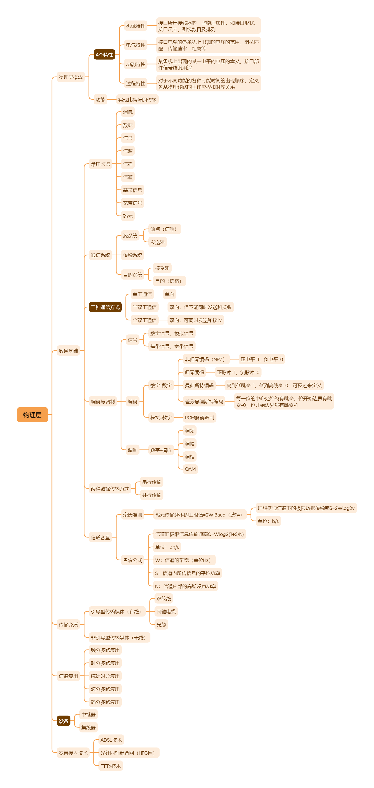

# 物理层

## 物理层概念

### 4个特性

- 机械特性

	- 接口所用接线器的一些物理属性，如接口形状、接口尺寸、引线数目及排列

- 电气特性

	- 接口电缆的各条线上出现的电压的范围、阻抗匹配、传输速率、距离等

- 功能特性

	- 某条线上出现的某一电平的电压的意义，接口部件信号线的用途

- 过程特性

	- 对于不同功能的各种可能时间的出现顺序，定义各条物理线路的工作流程和时序关系

### 功能

- 实现比特流的传输

## 数通基础

### 常用术语

- 消息

- 数据

- 信号

- 信源

- 信宿

- 信道

- 基带信号

- 宽带信号

- 码元

### 通信系统

- 源系统

	- 源点（信源）

	- 发送器

- 传输系统

- 目的系统

	- 接受器

	- 目的（信宿）

### 三种通信方式

- 单工通信

	- 单向

- 半双工通信

	- 双向，但不能同时发送和接收

- 全双工通信

	- 双向，可同时发送和接收

### 编码与调制

- 信号

	- 数字信号、模拟信号

	- 基带信号、宽带信号

- 编码

	- 数字-数字

		- 非归零编码（NRZ）

			- 正电平-1，负电平-0

		- 归零编码

			- 正脉冲-1，负脉冲-0

		- 曼彻斯特编码

			- 高到低跳变-1，低到高跳变-0，可反过来定义

		- 差分曼彻斯特编码

			- 每一位的中心处始终有跳变，位开始边界有跳变-0，位开始边界没有跳变-1

	- 模拟-数字

		- PCM脉码调制

- 调制

	- 数字-模拟

		- 调频

		- 调幅

		- 调相

		- QAM

### 两种数据传输方式

- 串行传输

- 并行传输

### 信道容量

- 奈氏准则

	- 码元传输速率的上限值=2W Baud（波特）

		- 理想低通信道下的极限数据传输率S=2Wlog2v

		- 单位：b/s

- 香农公式

	- 信道的极限信息传输速率C=Wlog2(1+S/N)

	- 单位：bit/s

	- W：信道的带宽（单位Hz）

	- S：信道内所传信号的平均功率

	- N：信道内部的高斯噪声功率

## 传输介质

### 引导型传输媒体（有线）

- 双绞线

- 同轴电缆

- 光缆

### 非引导型传输媒体（无线）

## 信道复用

### 频分多路复用

### 时分多路复用

### 统计时分复用

### 波分多路复用

### 码分多路复用

## 设备

### 中继器

### 集线器

## 宽带接入技术

### ADSL技术

### 光纤同轴混合网（HFC网）

### FTTx技术

