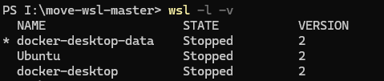

# 如何将WSL迁移到非系统盘

## 方法一（脚本）

### 1.下载[Move WSL](https://github.com/pxlrbt/move-wsl)工具

下载并解压工具（上方超链接）


### 2.检查wsl状态



<u>**在PowerShell下执行下列步骤**</u>

确保wsl下的系统处于关闭状态，STATE显示Stopped

```powershell
wsl -l -v
```

若为启动状态使用以下指令关闭

```powershell
wsl --shutdown
```


### 3.开始移动

```powershell
cd <move-wsl-master的路径>
.\move-wsl.ps1
```


选择要移动的目标，比如移动Ubuntu，则输入 1 并回车，然后会提示让我们输入移动的目标路径。


输入目标路径如 `E:\Ubuntu` 然后回车，便会执行移动。根据移动目标的大小，时间可长可短，请耐心等待。


### 4.修改默认用户

```powershell
<系统名> config --default-user <用户名>
```

修改为安装时注册的用户名


## 方法二（手动）

### 1.检查wsl状态


确保wsl下的系统处于关闭状态，STATE显示Stopped

```powershell
wsl -l -v
```

若为启动状态使用以下指令关闭

```powershell
wsl --shutdown
```


### 2.导出系统镜像

以压缩包的形式导出到其他盘。

```powershell
wsl --export <系统名> <存放压缩包的路径>

如：wsl --export Ubuntu D:\UbuntuWSL\ubuntu.tar
```


### 3.注销原有的linux系统

```powershell
wsl --unregister  <系统名>
```


### 4.导入系统

```powershell
wsl --import <导入的Linux名称> <导入盘的路径> <镜像的路径> --version 2 (代表wsl2)
```

```powershell
如：wsl --import Ubuntu E:\Ubuntu D:\UbuntuWSL\ubuntu.tar --version 2
```


### 5.修改默认用户

```powershell
<系统名> config --default-user <用户名>
```

修改为安装时注册的用户名


